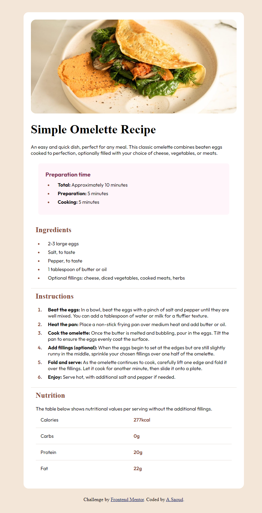

# Frontend Mentor - Recipe page solution

This is a solution to the [Recipe page challenge on Frontend Mentor](https://www.frontendmentor.io/challenges/recipe-page-KiTsR8QQKm). Frontend Mentor challenges help you improve your coding skills by building realistic projects. 

##  Welcome! 👋
Thanks for checking out this front-end coding challenge.
A responsive recipe page created for a Frontend Mentor coding challenge using HTML and CSS.

### Links

- Solution URL: [Add solution URL here](https://your-solution-url.com)
- Live Site URL: [Add live site URL here](https://your-live-site-url.com)

## My process

**Setup**
    - Semantic HTML structure.
    - Added Google Fonts and favicon.

2. **HTML Structure**
    - Sections for preparation time, ingredients, instructions, and nutrition.

3. **CSS Styling**
    - CSS variables for consistent colors.
    - Flexbox and grid for layout.
    - Mobile-first design with media queries.

4. **Optimization**
    - Removed redundant code.
    - Consolidated CSS rules.

## Project Structure

- `index.html`: HTML structure.
- `style.css`: CSS styling.
- `assets/`: Images and assets.
### Built with

- Semantic HTML5 markup
- CSS custom properties
- Flexbox
- CSS Grid
- Mobile-first workflow

### What I learned

- Importance of semantic HTML for accessibility.
- Effective use of CSS variables for theme consistency.
- Responsive design techniques using flexbox and grid.
- Writing clean and maintainable CSS code.

### Continued development

Programming or coding is a big ocean and this is just a drop , i will learn more and more 

## Author

- Linkedin - [abdallahsaoud](https://www.linkedin.com/in/abdallahsaoud/)
- Frontend Mentor - [@@Saoud2021](https://www.frontendmentor.io/profile/Saoud2021)

## Acknowledgments

my Best friend Abdelrahman sherif he is my mentor 
Linkedin - [abdelrhman-sherif](https://www.linkedin.com/in/abdelrhman-sherif/)
